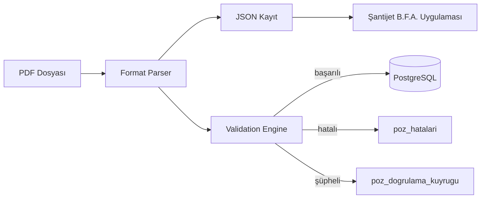

# Şantijet PDF Import Engine

Production seviyesinde PDF → yapısal veri aktarım sistemi.

## Amaç

Kamu kurumlarının yayımladığı birim fiyat analizlerini PDF kaynaklarından okuyup:

1. **JSON** (mobil/ web uygulamaları için)
2. **PostgreSQL** (merkezi arama, filtre, AI katmanı için)

formatlarına dönüştürmek.

> Bu sistem PDF dağıtım aracı değildir. Yalnızca kaynakta bulunan veriyi çıkarır; özetleme veya tahmin yapmaz.

## Mimari

```
services/pdf-import-engine/
├── parsers/          # Kurum/format bazlı parser adaptörleri
│   ├── base.py       # BasePdfParser arayüzü
│   └── mekanik_bfa.py
├── validation/       # Zorunlu doğrulama kuralları
├── db/               # PostgreSQL migration + repository
├── admin/            # FastAPI admin API (yükleme, geçmiş, hata, kuyruk)
├── scripts/          # CLI araçları
└── tests/
```

### Veri akışı



## Desteklenen formatlar

| format_id | Kurum | Durum |
|-----------|-------|-------|
| `mekanik_bfa` | ÇŞB YFK — Mekanik Tesisat B.F.A. 2026 (Cilt 1-3) | ✅ 5.646 kayıt |
| `insaat_bfa` | ÇŞB YFK — İnşaat B.F.A. 2026 | 🔜 |

## Hızlı başlangıç

### Mekanik BFA → JSON

```bash
pip install -r requirements.txt
python scripts/parse_mekanik_bfa.py
```

Çıktı: `artifacts/imalat-poz-analizleri/assets/data/resmi-mekanik-analizleri.json`

### Docker + PostgreSQL

```bash
docker compose up -d
```

Admin API: http://localhost:8090/docs

### Testler

```bash
pytest tests/ -q
```

## Validation kuralları

- Poz numarası, ad, birim ve kaynak dosya zorunlu
- Aynı poz numarası tekrar edemez
- Şüpheli OCR karakterleri doğrulama kuyruğuna alınır
- Import sonrası PDF poz sayısı ile DB sayısı karşılaştırılır; eksik varsa import başarısız sayılır

## AI katmanı (2. aşama)

Import tamamlandıktan sonra `poz_kayitlari.payload` üzerinden:

- Poz açıklaması üretme
- Benzer/alternatif poz önerme
- Metraj yardımcısı
- Maliyet analizi

özellikleri eklenebilir — mevcut mimari bu katmanı engellemez.
